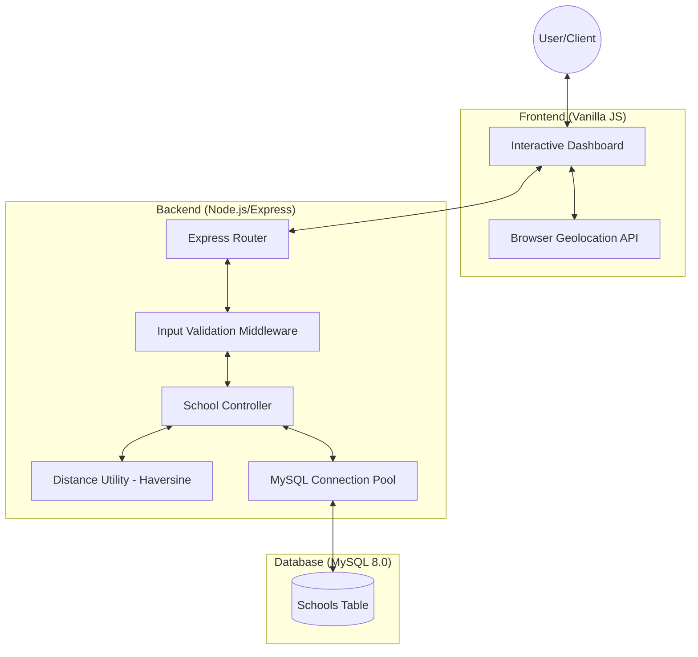

# 🏫 School Management API

A modern, containerized Node.js REST API for managing school data with **proximity-based sorting**. This project calculates the distance between a user's coordinates and registered schools using the **Haversine formula**.

---

## 🏗️ System Design



---

## ⚙️ Tech Stack

| Layer          | Technology             |
|----------------|------------------------|
| **Runtime**    | Node.js (v18+)         |
| **Framework**  | Express.js             |
| **Database**   | MySQL 8.0              |
| **Container**  | Docker & Docker Compose |
| **Logic**      | Haversine Formula      |
| **Frontend**   | HTML5, CSS3, Vanilla JS |

---

## 🚀 Quick Start (with Docker)

The easiest way to get the project running is using **Docker Compose**.

1.  **Clone the repository**:
    ```bash
    git clone https://github.com/your-username/school-management-api.git
    cd school-management-api
    ```

2.  **Start the services**:
    ```bash
    docker-compose up --build
    ```

3.  **Access the App**:
    Open [http://localhost:3000](http://localhost:3000) in your browser.

---

## 📡 API Reference

### `POST /api/addSchool`
Adds a new school to the database.
- **Body**: `{ name, address, latitude, longitude }`

### `GET /api/listSchools`
Returns all schools sorted by distance from the user.
- **Query Params**: `latitude`, `longitude`

---

## 📁 Project Structure

```text
school-management-api/
├── backend/
│   ├── config/      # DB connection pool
│   ├── controllers/ # Business logic
│   ├── routes/      # Express routes
│   ├── middlewares/ # Input validation
│   ├── utils/       # Distance calculation
│   └── sql/         # Database schema
├── frontend/        # Static UI files
├── postman/         # API testing collection
├── docker-compose.yml
└── README.md
```

---

